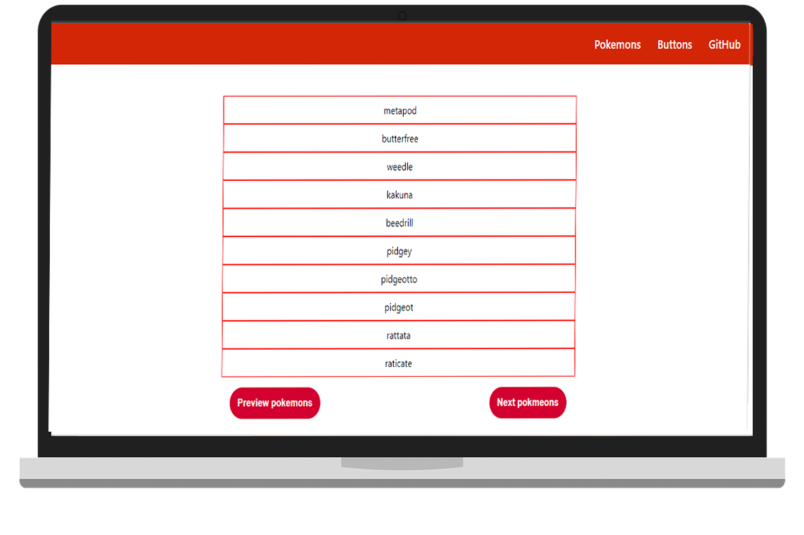
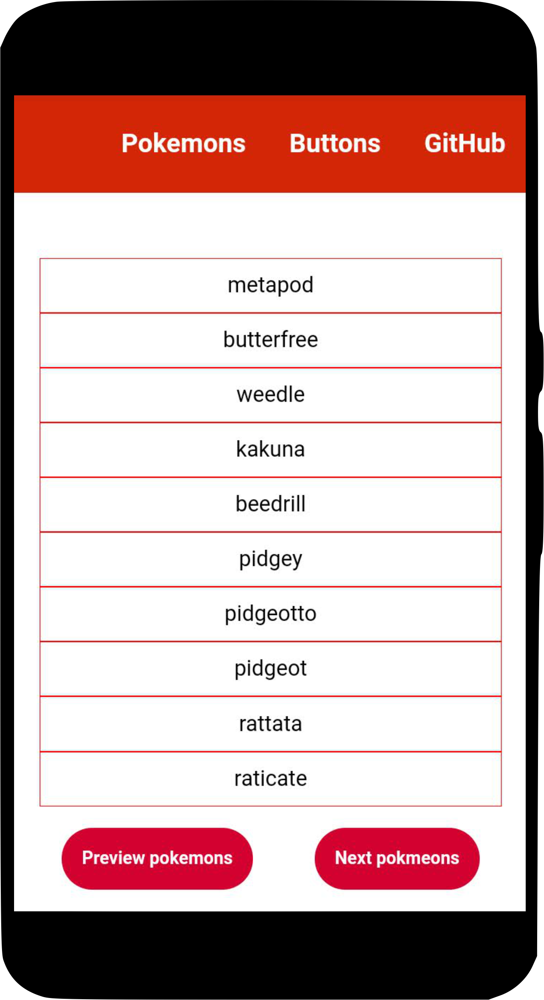

<h1 align="center">
    
</h1>

  <a href="#-tecnologias">Tecnologias</a>&nbsp;&nbsp;&nbsp;|&nbsp;&nbsp;&nbsp;
  <a href="#-projeto">Projeto</a>&nbsp;&nbsp;&nbsp;|&nbsp;&nbsp;&nbsp;
  <a href="#memo-licença">Licença</a>&nbsp;&nbsp;&nbsp;|&nbsp;&nbsp;&nbsp;
  <a href="#executar">Execução</a>

  

 

  

<h2 align=center>Responsividade no Smartphone :iphone: </h2>

  

## 🚀 Tecnologias

Esse projeto foi desenvolvido com a biblioteca:
- [React.js](https://pt-br.reactjs.org/)

Linguagens de marcação, estilo e programação:
 
<ul>
<li>HTML</li>
<li>CSS</li>
<li>JavaScript</li>
</ul>

## 💻 Projeto

O React Pokemon  é uma aplicação feita baseada em um desafio proposto em uma entrevista de emprego para um desenvolvedor júnior. Essa aplicação, têm o propósito de levar o entendimento dos conceitos dos hooks e uso da biblioteca React, para criar uma aplicação capaz de se comunicar com dados que trafegam na web através de uma API pública.

## :memo: Licença

Esse projeto está sob a licença MIT. Veja o arquivo [LICENSE](https://github.com/lazarok09/react-pokemon/blob/main/LICENSE) para mais detalhes.

--

<h2 id="executar">
:red_circle: Como Executar
</h2>

### Clone e abra o repositório, dentro do seu editor favorito, execute no terminal =>
~~~javascript
npm install node
~~~
### Em seguida startar a aplicação no terminal
#### Siga para a pasta src/views e digite 
~~~ javascript
npm start
~~~~
##### Será aberto a aplicação, cole no URL do seu navegador - localhost:5500
## :pencil2: Autor
Lazaro Souza :runner:  
Entusiasta na arte de aprender algo do zero 
Cursando Superior de Tecnologia em Análise e Desenvolvimento de Sistemas :books: (2020-2022) 

https://www.linkedin.com/in/lazarok09
### Aprenda a usar o [markdown](https://docs.pipz.com/central-de-ajuda/learning-center/guia-basico-de-markdown#open) no seu GitHub
#### Use [emojis](https://github.com/ikatyang/emoji-cheat-sheet) no seu readme :P

< / :heart: >

